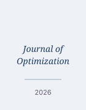

## 快速开始

1. 编辑 `index.html` — 修改姓名、学校、研究方向
2. 将个人照片放到 `assets/img/profile.jpg`（推荐 3:4 比例）
3. 将简历 PDF 放到 `files/cv.pdf`
4. 推送到 GitHub — 自动部署到 `plumaly.github.io`

## 文件结构

```
├── index.html                 ← 主页面（单页滚动）
├── 404.html
├── assets/
│   ├── css/
│   │   ├── base.css           ← 重置、颜色变量、排版
│   │   ├── layout.css         ← 页面布局、导航、各区块
│   │   ├── components.css     ← 按钮、标签、手风琴等组件
│   │   └── blog.css           ← 博客列表和文章页样式
│   ├── js/
│   │   ├── theme.js           ← 深色/浅色模式切换
│   │   ├── scroll.js          ← 平滑滚动、导航高亮、回到顶部
│   │   ├── filter.js          ← 论文分类筛选
│   │   └── blog.js            ← Markdown 解析器和博客渲染
│   └── img/
│       └── profile.jpg        ← 你的个人照片（3:4 比例）
├── blog/
│   ├── index.html             ← 博客列表页
│   ├── post.html              ← 博客文章详情页
│   ├── posts.json             ← 博客文章清单（添加新文章请编辑此文件）
│   └── posts/                 ← 博客 Markdown 文件存放处
│       ├── 2026-05-01-large-scale-lp.md
│       ├── 2026-04-20-primal-dual-ipm.md
│       └── 2026-03-15-getting-started-julia.md
├── images/
│   └── publications/          ← 论文缩略图
│       ├── 1.svg
│       ├── 2.svg
│       └── 3.svg
├── files/
│   └── cv.pdf                 ← 你的简历 PDF
└── README.md
```

## 如何修改网站内容

### 修改姓名和基本信息

编辑 `index.html`：
- **姓名**：搜索 `<h1 class="hero__name">Yue Yu</h1>` — 修改名字
- **职称**：搜索 `<p class="hero__title">Ph.D. Student ...</p>`
- **所属机构**：搜索 `<p class="hero__affiliation">Your University ...</p>`
- **研究方向**：搜索 `<ul class="hero__research">` — 编辑其中的 `<li>` 列表项
- **邮箱**：搜索 `yue_yu_2004@163.com` — 替换所有出现的地方（首页和页脚各一处）
- **社交链接**：搜索 `<ul class="social">` — 更新 GitHub、Google Scholar、LinkedIn 的链接

### 修改个人照片

替换 `assets/img/profile.jpg` 为你自己的照片。推荐 3:4 比例（宽:高），至少 440×586 像素。如果照片不存在，CSS 会自动显示首字母 "YY" 作为备选。

### 添加/编辑论文

每篇论文在 `index.html` 中是一个 `<li class="publication__card">`。关键结构：

```html
<li class="publication__card" data-category="journal">  <!-- journal / conference / working -->
  <article class="publication__main" aria-expanded="false">
    <!-- 缩略图，点击可在新窗口打开大图 -->
    <a class="publication__thumbnail-link" href="images/publications/1.svg" target="_blank">
      
    </a>
    <div class="publication__info">
      <h3 class="publication__title">论文标题</h3>
      <p class="publication__authors">
        <span class="publication__author--self">Yue Yu</span>, 其他作者
        <!-- ↑ 用这个 span 包裹你自己的名字来高亮显示 -->
      </p>
      <p class="publication__venue">期刊名称, 年份</p>
      <div class="publication__links">
        <a class="publication__link" href="链接">PDF</a>
        <a class="publication__link" href="链接">DOI</a>
      </div>
    </div>
    <span class="publication__expand-icon">▼</span>
  </article>
  <div class="publication__abstract">
    <p class="publication__abstract-text">摘要内容...</p>
  </div>
</li>
```

操作步骤：
1. 复制一个已有的论文条目
2. 设置 `data-category` 为 `journal`、`conference` 或 `working`
3. 将缩略图放到 `images/publications/` 目录
4. 用 `<span class="publication__author--self">` 包裹你自己的名字

### 修改简历内容

编辑 `index.html` 中的 CV 区块。每个条目格式如下：

```html
<div class="cv__entry">
  <div class="cv__entry-header">
    <span class="cv__entry-title">职位/学位名称</span>
    <span class="cv__entry-date">2024 – 至今</span>
  </div>
  <p class="cv__entry-subtitle">机构名称</p>
  <div class="cv__entry-desc">
    <ul>
      <li>描述内容</li>
    </ul>
  </div>
</div>
```

要替换简历 PDF 下载链接，将你的 PDF 文件放到 `files/cv.pdf`。

### 添加博客文章

1. 用 Markdown 写好文章，保存到 `blog/posts/YYYY-MM-DD-简短标题.md`
2. 编辑 `blog/posts.json`，添加一条记录：

```json
{
  "file": "2026-06-01-我的新文章.md",
  "title": "我的新文章标题",
  "date": "2026-06-01",
  "summary": "一句话描述这篇文章的内容。"
}
```

首页的博客区块和 `/blog/` 页面都会自动显示新文章。点击文章会跳转到详情页，自动将 Markdown 转换为带样式的 HTML。

### 支持的 Markdown 语法

`.md` 文件支持以下语法：

- `# 一级标题` 到 `###### 六级标题`
- `**加粗**` 和 `*斜体*`
- `[链接](url)` 和 ``
- `- 无序列表` 和 `1. 有序列表`
- `` `行内代码` `` 和 ` ``` ` 围栏代码块
- `> 引用`
- `---` 分隔线
- `$行内公式$` 和 `$$独立公式$$`（LaTeX 公式，由 KaTeX 渲染）

### 修改主题颜色

编辑 `assets/css/base.css`，找到 `:root { ... }` 块：

```css
--color-accent: #8b1a2b;       /* 酒红色 — 修改此处更换强调色 */
--color-navy: #1e3a5f;         /* 深蓝色 — 区块标题下划线 */
--color-bg: #fdfcfb;           /* 页面背景色 */
--color-surface: #ffffff;      /* 卡片背景色 */
```

深色模式的颜色在下面的 `[data-theme="dark"]` 块中修改。

### 修改字体

编辑 `assets/css/base.css`，找到顶部的 `@import` 语句。将 `Crimson+Pro`（标题字体）和 `Inter`（正文字体）替换为任何 Google Font。然后修改：

```css
--font-heading: "你的字体", Georgia, serif;
--font-body: "你的字体", -apple-system, sans-serif;
```

## 部署

直接推送到 GitHub 仓库的 `main` 分支，GitHub Pages 会自动从 `main` 分支部署。不需要任何构建步骤。

本地预览：
```bash
python3 -m http.server 8080    # 或其他任意静态文件服务器
# 浏览器打开 http://localhost:8080
```

## 技术说明

- **零框架**：完全不依赖任何 JavaScript 或 CSS 第三方库
- **深色模式**：偏好保存到 localStorage，自动跟随系统设置
- **移动端适配**：768px 断点响应式，汉堡菜单
- **BEM 命名**：所有 CSS 类名遵循 Block__Element--Modifier 规范
- **无障碍**：跳过导航链接、ARIA 标签、语义化 HTML 标签
